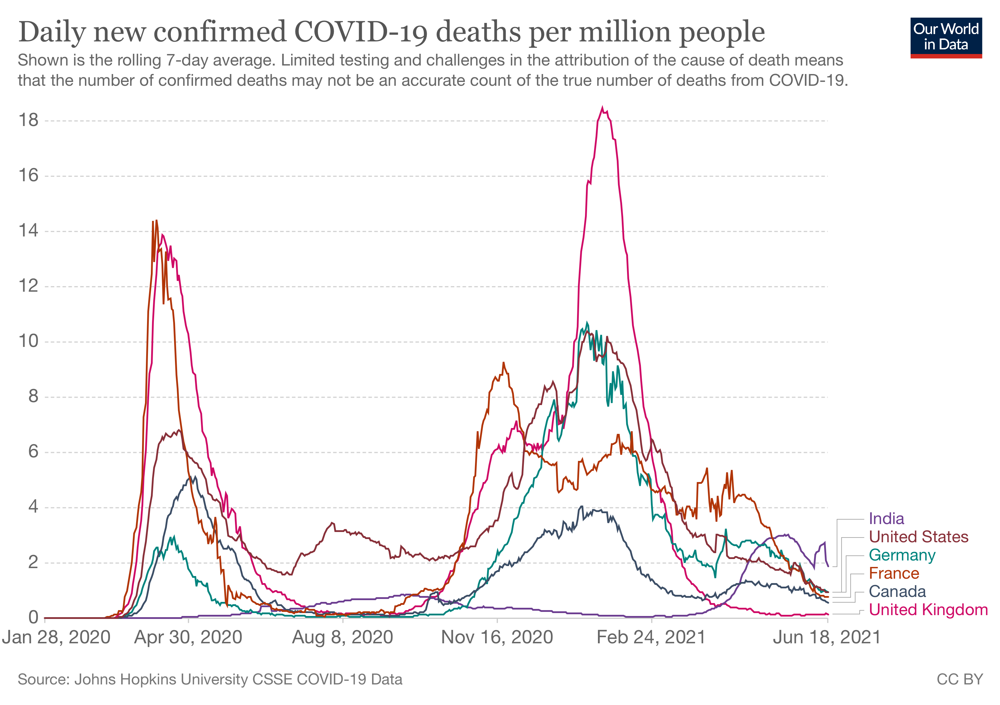
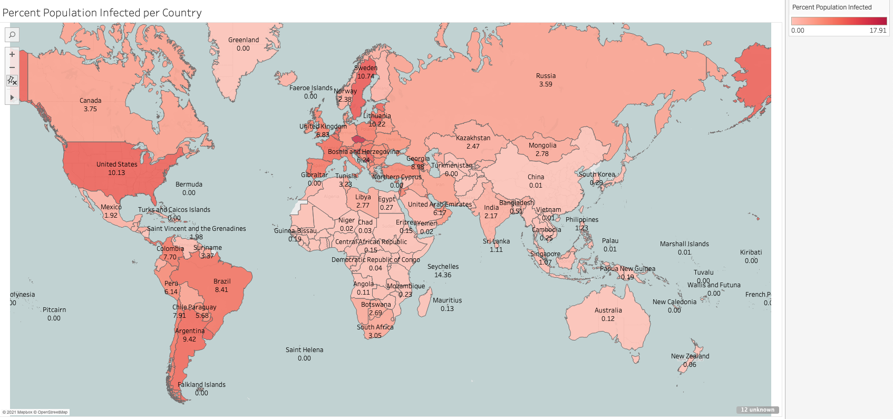
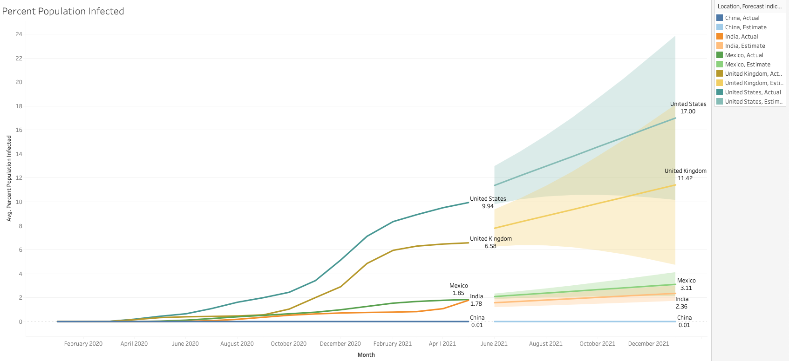
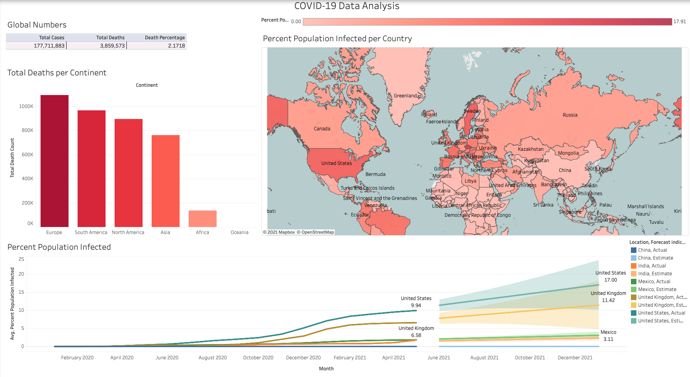

# COVID-data
This repo houses data and code for the analyses of COVID-19 cases, deaths, vaccinations based on Countries and Continents.

* This project explored the COVID-19 cases all over the world on the basis of the population, total deaths and vaccinations.
* The Data is collected from Our World in Data Website for COVID-19: [Dataset](https://ourworldindata.org/covid-deaths) which is published by COVID-19 Data Repository by the Center for Systems Science and Engineering (CSSE) at [Johns Hopkins University](https://github.com/CSSEGISandData/COVID-19).
* Sample metadata is at data/. This folder has the following tables:  
data/CovidDeaths and  
 data/CovidVaccinations.
* The data collected was from Jan 28th, 2020 till June 18th, 2021

* The tools used to analyze the data were MSSQL server, MS Excel and Tableau Public.
* The highlights of the analysis is as  below:
1. Worldwide the mortality rate is 2.17%; meaning out of total positive tested cases, the death percentage is 2.17%
2. Europe has the highest number of deaths with a death count of 1 Million followed by South America and North America.

3. There are a total of 177 Million positive cases and almost 4 Million deaths.
4. United States has the highest percent of population infected by COVID. 10.13% of the US population has been tested positive.

5. [Tableau Dashboard](https://public.tableau.com/app/profile/kiran8286/viz/COVID-19DataAnalysis_16242300630070/Dashboard1)

[My Portfolio](https://kiranpatel04.github.io/Kiran_Portfolio-2/post/)

[Tableau Link](https://public.tableau.com/views/COVID-19DataAnalysis_16242300630070/Dashboard1?:language=en-US&:retry=yes&:display_count=n&:origin=viz_share_link)
